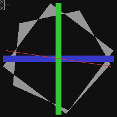

# Jaggies - a tiny vector graphics library

```asciiart
    |               o
    |,---.,---.,---..,---.,---.
    |,---||   ||   |||---'`---.
`---'`---^`---|`---|``---'`---'
          `---'`---'
```

Jaggies is a tiny C library for drawing filled polygons
and lines using only integer math, static allocations
and the standard C library.

This makes Jaggies well suited for running on micro
controllers with limited memory.

Jaggies uses a global state, which is built up by
adding polygons and lines.

The global state is then rendered in one continuous flow,
one pixel at a time, row by row. Polygons are renderer
back to front, where latest added polygons will overdraw
earlier. Lines are always drawn on top.

This makes it possible to draw basic vector graphics
to destinations without random access frame buffer
access. No frame buffer is used internally either,
keeping memory requirements low.

Jaggies is distributed under the MIT license.

## Getting started

Basic example:

```C
void setPixel(void* context, unsigned char color) {
    SomeBitmap* bmp = (SomeBitmap*) context;
    // implementation here!
}

SomeBitmap *bmp = createBitmapSomehow();

// Clear the global state
jaggieClear();

// A square
jaggiePoint square[] = {
    {4, 1},

    {10, 10},
    {100, 10},
    {100, 100},
    {10, 100}
};

// Add a polygon
jaggiePoly(square);

// Render using `setPixel` above
jaggieRender(150, 150, 0, setPixel, bmp);
```

The full five function API is documented in [jaggies.h](jaggies.h).

Check out the example in the [test](test) folder.



> NOTE: The example uses the awesome [tigr](https://github.com/erkkah/tigr) library, which is included as a submodule, but Jaggies itself has no external dependencies.

## Memory requirement and other tweaks

Since required structures are statically allocated, the overall memory requirement is defined by the coordinate type and the maximum number of lines and polygons in the global render state.

These are set to relatively low levels (`short int` coordinates, 16 polygons and 48 lines) by default, and can be overridden by setting the `JAGGIE_INT`, `JAGGIE_MAX_POLYS` and `JAGGIE_MAX_LINES` preprocessor defines.

The pixel type is `unsigned char` by default, but can be changed by setting the `JAGGIE_COLOR` define.

If you are really low on memory and cycles, multi-color support can be turned off by setting the `JAGGIE_SINGLE_COLOR` define.
This causes all primitives to be drawn in the same color, using the last value set by `jaggieColor()`.

## Known issues

* Jaggies is designed for limited memory situations, it is not your fastest pixel pushing friend. But that's OK.

* Jaggies uses a global state which makes drawing several scenes at the same time impossible. Also fine.
